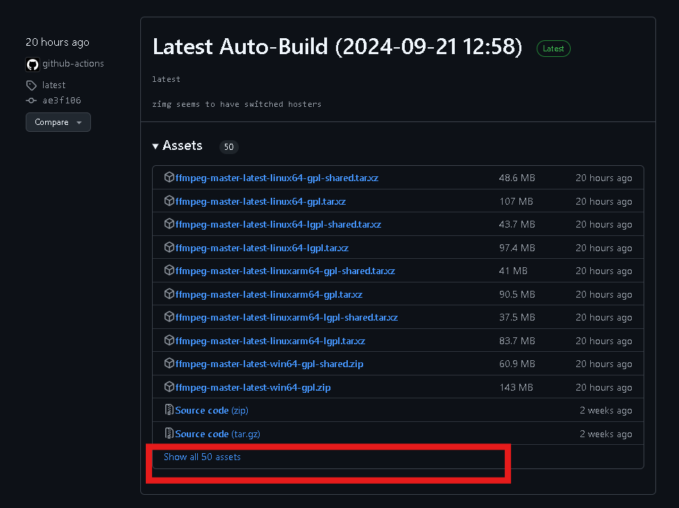
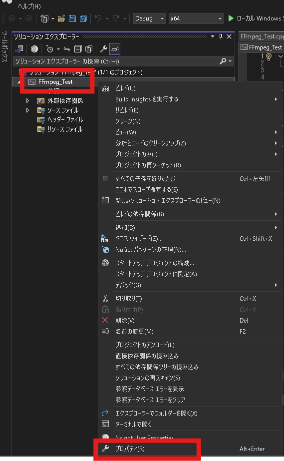
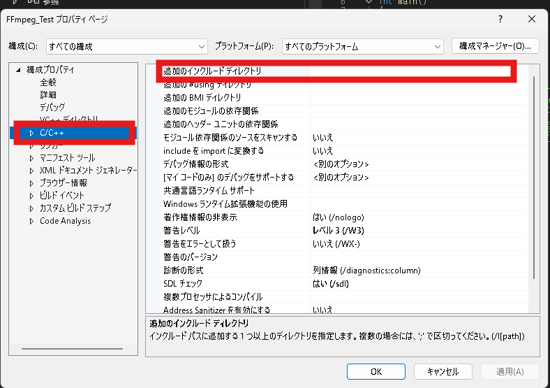
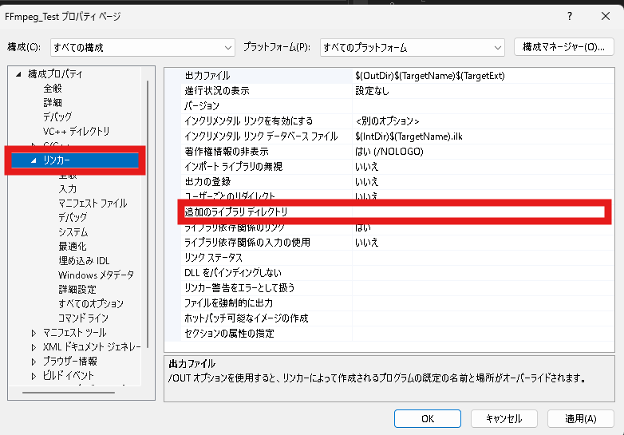
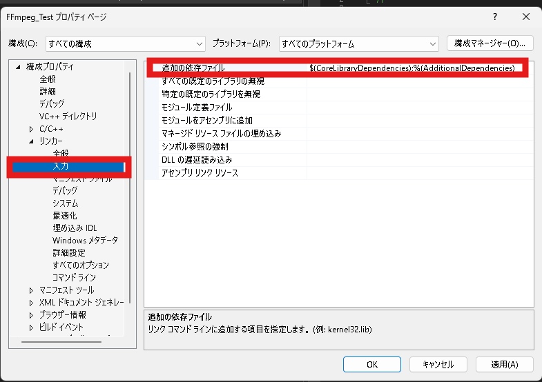

+++
title = 'FFmpegAPIをVisualStudioで利用する方法'
date = 2024-09-22T15:07:11+09:00
draft = false
tags = ['FFmpeg','VisualStudio','Windows','C++']
+++
最強のマルチメディアソフトである「FFmpeg」をVisualStudioで利用する方法を書きます。
<!--more-->
# 環境
- Windows11
- VisualStudio2022

# 手順
## 1.「ffmpeg-master-latest-win64-lgpl-shared.zip」をダウンロードする
['FFmpegの公式サイト'](https://www.ffmpeg.org/)の['Download FFmpeg'](https://www.ffmpeg.org/download.html#build-windows)へ行くと下図の様なページが表示される。

Windowsのマークをクリックし、「Windows builds by BtbN」 を選択する。

すると、下図のようなページが表示される。

「Show all 50 assets」をクリックする。
するとたくさんのファイルが表示される。その中の
「ffmpeg-master-latest-win64-lgpl-shared.zip」をクリックする。

すると「ffmpeg-master-latest-win64-lgpl-shared.zip」がダウンロードされる。


>**tip**:今回はライセンス的に色々安心できる「ffmpeg-master-latest-win64-lgpl-shared.zip」を扱いますが、FFmpegを商用利用する気がない場合は「ffmpeg-master-latest-win64-gpl-shared.zip」のダウンロードをオススメします。lgpl版より豊富なエンコーダー,デコーダーが利用できますよ。

## 2. FFmpegのパスを通す
先ほどダウンロードした
「ffmpeg-master-latest-win64-lgpl-shared.zip」
を任意のフォルダへ展開する。
今回自分は以下のディレクトリへ展開した。
```
C:\Users\%USERNAME%\OneDrive\デスクトップ\ffmpeg-master-latest-win64-lgpl-shared
```

展開後、ユーザー環境変数へ新規変数の登録をオススメする。（VisualStudioでの利用時に役立つため。）
今回自分は以下のようなユーザー環境変数を新規に登録した。
```
変数名：FFMPEG_PATH
変数値：C:\Users\%USERNAME%\OneDrive\デスクトップ\ffmpeg-master-latest-win64-lgpl-shared\bin
```

お次は
ユーザー環境変数のPathへ先ほど登録した変数を追加する。
```
%FFMPEG_PATH%
```
と登録すればOK。

最後に本当にパスが通っているのか確認する。
コマンドラインを立ち上げ、下記を実行させる。
```
ffmpeg -h
```
パスが正しく通っている場合はいろいろなコマンドの説明が表示される。

## 3. VisualStudioでC++のプロジェクトを作る
VisualStudioを起動し、C++の「コンソールアプリ」のテンプレートを選択して新しいプロジェクトを作成する。
プロジェクト名は何でもいいです。今回自分は「FFmpeg_Test」とした。

## 4. プロジェクトのプロパティを設定する

プロジェクトの作成後、下図の赤枠の
「FFmpeg_Test」を右クリックし、コンテキストメニュー欄の「プロパティ」をクリックする。


「FFmpeg_Testのプロパティページ」が表示された後、下図の赤枠の「C/C++」をクリックし、「追加のインクルードディレクトリ」をクリックする。



「追加のインクルードディレクトリ」へ下記を入力する。
```
$(FFMPEG_PATH)\include
```

次に下図の赤枠の「リンカー」をクリックし、「追加のライブラリディレクトリ」をクリックする。


「追加のライブラリディレクトリ」へ下記を入力する。
```
$(FFMPEG_PATH)\lib
```


次に下図の赤枠の「入力」をクリックし、「追加の依存ファイル」をクリックする。

「追加の依存ファイル」へ下記を入力する。
```
avcodec.lib;avdevice.lib;avfilter.lib;avformat.lib;avutil.lib;swresample.lib;swscale.lib;$(CoreLibraryDependencies);%(AdditionalDependencies)
```

以上の設定が完了した後は「FFmpeg_Testのプロパティページ」の下部にある「適応(A)」をクリックし、設定を適応させる。

## 4.テストプログラムを実行する
「FFmpeg_Test」プロジェクト内の「ソースファイル」内にある「FFmpeg_Test.cpp」へ下記を入力する。
```c++{name=FFmpeg_Test.cpp}
extern "C" {
#include <libavdevice/avdevice.h>
}

#include<iostream>

int main(void) {
    avdevice_register_all();
    std::cout << "FFmpeg API" << std::endl;
}
```
入力後、「ローカルWindowsデバッカー」もしくはF5キーを押して実行させる。
```{name="実行結果"}
FFmpeg API
```
と表示されていたらOK。問題なくFFmpegAPIが利用できています。もしエラーが発生した場合はパスが通っているか、プロジェクトのプロパティを正しく設定しているか、などを確認してみてください。

## 5.使いこなしていくには
[公式の参考プログラム](https://www.ffmpeg.org/doxygen/trunk/examples.html)を実行したり、ネットでいろいろな記事を見てFFmpegAPIを使いこなしていきましょう。公式のドキュメントがやはり参考になります。 